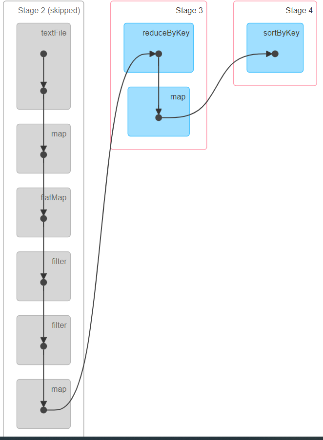

# Transformation and Actions
- At runtime we do not build RDDs during **TRANSFORMATIONS**. 
- All we are building is an **EXECUTION PLAN**.
- Only when we run an **ACTION** (make calculations happen and get results) does anything happens

# DAG and SparkUI
- localhost:4040
- 
- 
- In SparkUI we have list of Jobs (actions performed in our script roughly)
- sortByKey is an transformation but still generates a job in Job list

# Narrow vs Wide Transformations
- How does spark decide partitioning? -> It depends on the input source for the RDD. 
  - Text file => chunks of data
  - Some other sources => Hashes of each string line is calculated and hashes are distributed in different partitions
- Now transformations are sent to each Partition : Block of code executing against a Partition is called **TASK**
- **Narrow transformations** : Spark can implement these without moving any data around. Egg: rdd.filter(CONDITION)
  - input partition -> output partition
- **Wide transformations** : Spark can implement these with moving data around. Egg: rdd.groupByKey(...)
  - Data movement is called **SHUFFLING**
  - Network traffic is present as partitions are distributed across nodes.
  - Also, these partitions are converted to binary to transport across network (**SERIALIZATION**)
  - Shuffling is expensive operation
  - 

#Shuffles
- **STAGE** : Series of transformations that don't need shuffle. When a shuffle is required Spark creates a new stage.
- 
- A shuffle write is done, where data is written on disk, so hat it can be serialized