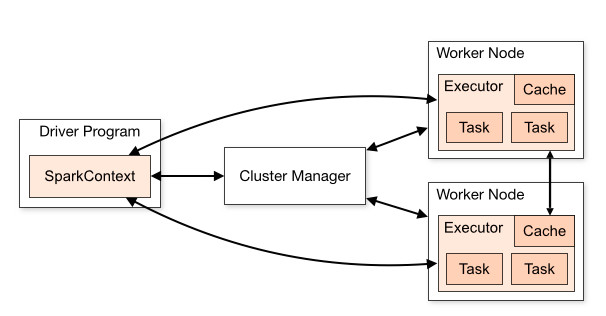
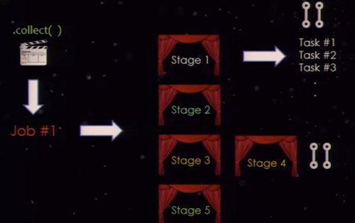
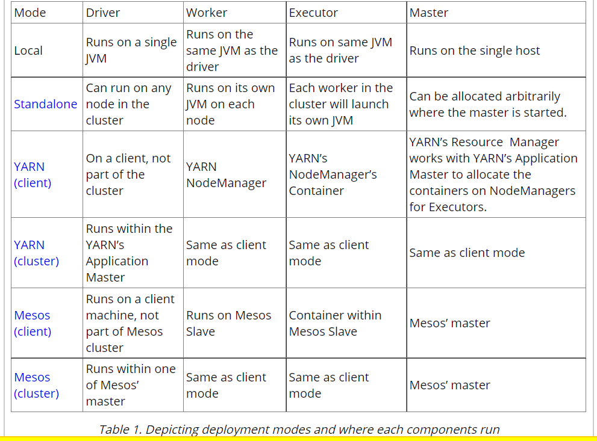
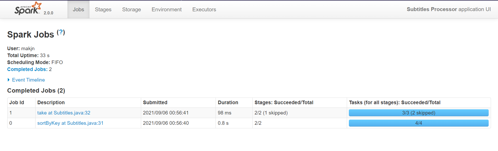
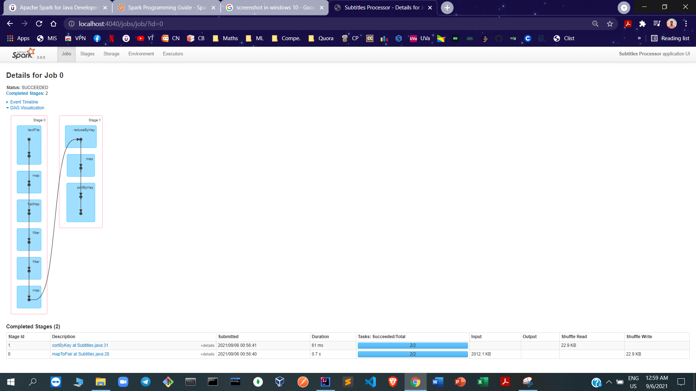
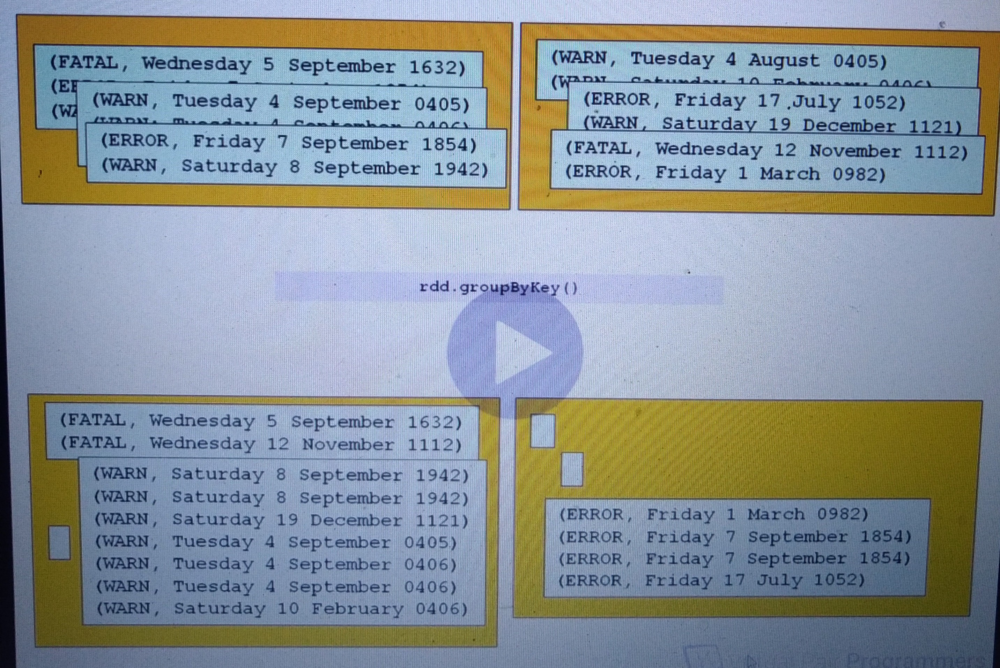
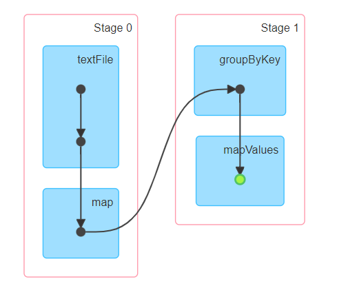
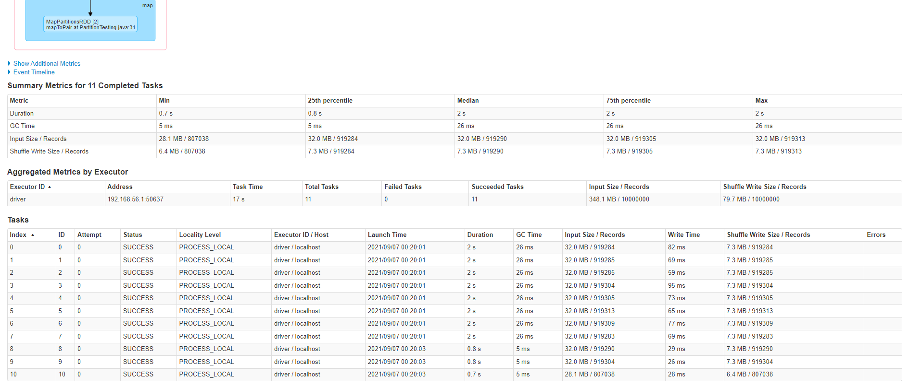
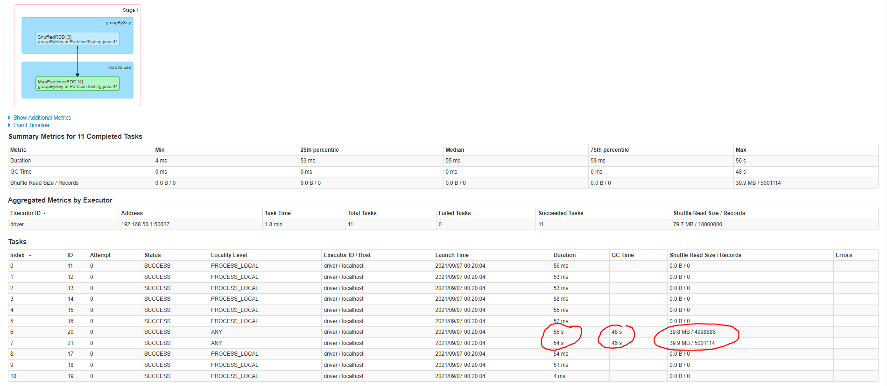

#Spark Arch.
- 
- 
- 

# Transformation and Actions
- At runtime we do not build RDDs during **TRANSFORMATIONS**. (***LAZY EVALUATION***)
- All we are building is an **EXECUTION PLAN**.
- Only when we run an **ACTION** (make calculations happen and get results) does anything happens

# DAG and SparkUI
- localhost:4040
- 
- 
- In SparkUI we have list of Jobs (actions performed in our script roughly)
- sortByKey is a transformation but still generates a job in Job list

# Narrow vs Wide Transformations
- How does spark decide partitioning? -> It depends on the input source for the RDD. 
  - Text file => chunks of data
  - Some other sources => Hashes of each string line is calculated and hashes are distributed in different partitions
- Now transformations are sent to each Partition : Block of code executing against a Partition is called **TASK**
- **Narrow transformations** : Spark can implement these without moving any data around. Egg: rdd.filter(CONDITION)
  - input partition -> output partition
- **Wide transformations** : Spark can implement these with moving data around. Egg: rdd.groupByKey(...)
  - Data movement is called **SHUFFLING**
  - Network traffic is present as partitions are distributed across nodes.
  - Also, these partitions are converted to binary to transport across network (**SERIALIZATION**)
  - Shuffling is expensive operation
  - **TRY TO HAVE WIDE TRANSFORMATIONS AT LAST IN THE PROGRAM AFTER ALL FILTERING etc. SO WIDE TRANSFORMATION HAVE TO WORK ON SMALL SUBSETS OF DATA**
  - 

# Shuffles
- **STAGE** : Series of transformations that don't need shuffle. When a shuffle is required Spark creates a new stage.
- 
- Between the stages : A shuffle write is done, where data is written on disk, so hat it can be serialized and then read by next stage (PUSH - PULL Model)
- Other info in UI : 
  - 
  - GC is Garbage Collection

# groupByKey performance 
- We have data of form
  ERROR: Thu Jun 04 10:37:51 BST 2015
  WARN: Sun Nov 06 10:37:51 GMT 2016
  WARN: Mon Aug 29 10:37:51 BST 2016
- We want to count how many lines are of WARN and how many of ERROR. We write following code :
  ````java
  public class PartitionTesting {
    @SuppressWarnings("resource")
    public static void main(String[] args) 
    {
        System.setProperty("hadoop.home.dir", "c:/hadoop");
        Logger.getLogger("org.apache").setLevel(Level.WARN);
		
        SparkConf conf = new SparkConf().setAppName("startingSpark").setMaster("local[*]");
        JavaSparkContext sc = new JavaSparkContext(conf);
		
        JavaRDD<String> initialRdd = sc.textFile("Tutorial/src/main/resources/bigLog.txt");

        System.out.println("Initial RDD Partition Size: " + initialRdd.getNumPartitions());
        JavaPairRDD<String, String> warningsAgainstDate = initialRdd.mapToPair( inputLine -> {
            String[] cols = inputLine.split(":");
            String level = cols[0];
            String date = cols[1];
            return new Tuple2<>(level, date);
        });
		
        System.out.println("After a narrow transformation we have " + warningsAgainstDate.getNumPartitions() + " parts");
		
        // Now we're going to do a "wide" transformation
        JavaPairRDD<String, Iterable<String>> results = warningsAgainstDate.groupByKey();
		
        results = results.persist(StorageLevel.MEMORY_AND_DISK());
        System.out.println(results.getNumPartitions() + " partitions after the wide transformation");
        results.foreach(it -> System.out.println("key " + it._1 + " has " + Iterables.size(it._2) + " elements"));
        System.out.println(results.count());
  
        Scanner scanner = new Scanner(System.in);
        scanner.nextLine();
        sc.close();
    }
  }
  ````
- The output for groupByKey stage is : 
  - 
  - Here we can see only 2 of the tasks are doing all the job as there are two keys in total and thus very huge time for these 2 tasks
  - A partition has all WARN keys and second partition has all ERROR keys, all other partitions are empty

# Dealing with skew data
- 
- **Salting keys**
  - 
  - Salting just mangles the keys to artificially spread them across the partitions. At some point we to group it together
  - Change the keys' name so that skewed keys are distributed. Here the numbers in the changed names are called **SALTS**