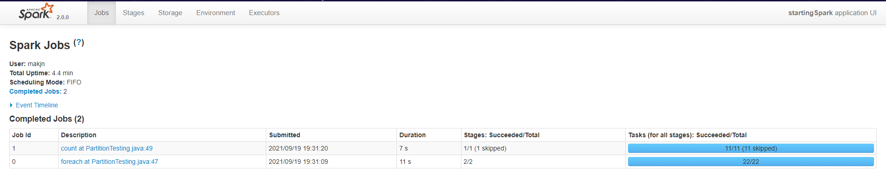
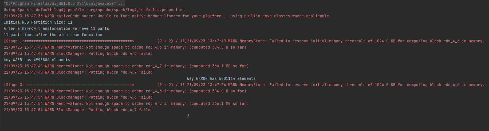

# Spark Arch.
- 
- 
- 

# Transformation and Actions
- At runtime we do not build RDDs during **TRANSFORMATIONS**. (***LAZY EVALUATION***)
- All we are building is an **EXECUTION PLAN**.
- Only when we run an **ACTION** (make calculations happen and get results) does anything happens

# DAG and SparkUI
- localhost:4040
- 
- 
- In SparkUI we have list of Jobs (actions performed in our script roughly)
- sortByKey is a transformation but still generates a job in Job list

# Narrow vs Wide Transformations
- How does spark decide partitioning? -> It depends on the input source for the RDD. 
  - Text file => chunks of data
  - Some other sources => Hashes of each string line is calculated and hashes are distributed in different partitions
- Now transformations are sent to each Partition : Block of code executing against a Partition is called **TASK**
- **Narrow transformations** : Spark can implement these without moving any data around. Egg: rdd.filter(CONDITION)
  - input partition -> output partition
- **Wide transformations** : Spark can implement these with moving data around. Egg: rdd.groupByKey(...)
  - Data movement is called **SHUFFLING**
  - Network traffic is present as partitions are distributed across nodes.
  - Also, these partitions are converted to binary to transport across network (**SERIALIZATION**)
  - Shuffling is expensive operation
  - **TRY TO HAVE WIDE TRANSFORMATIONS AT LAST IN THE PROGRAM AFTER ALL FILTERING etc. SO WIDE TRANSFORMATION HAVE TO WORK ON SMALL SUBSETS OF DATA**
  - 

# Shuffles
- **STAGE** : Series of transformations that don't need shuffle. When a shuffle is required Spark creates a new stage.
- Independent stages can run in parallel
- 
- Between the stages : A shuffle write is done, where data is written on disk, so hat it can be serialized and then read by next stage (PUSH - PULL Model)
- Other info in UI : 
  - 
  - GC is Garbage Collection

# groupByKey performance 
- We have data of form <br>
  ERROR: Thu Jun 04 10:37:51 BST 2015 <br>
  WARN: Sun Nov 06 10:37:51 GMT 2016 <br>
  WARN: Mon Aug 29 10:37:51 BST 2016 <br>
- We want to count how many lines are of WARN and how many of ERROR. We write following code :
  ````java
  public class PartitionTesting {
    @SuppressWarnings("resource")
    public static void main(String[] args) 
    {
        System.setProperty("hadoop.home.dir", "c:/hadoop");
        Logger.getLogger("org.apache").setLevel(Level.WARN);
		
        SparkConf conf = new SparkConf().setAppName("startingSpark").setMaster("local[*]");
        JavaSparkContext sc = new JavaSparkContext(conf);
		
        JavaRDD<String> initialRdd = sc.textFile("Tutorial/src/main/resources/bigLog.txt");

        System.out.println("Initial RDD Partition Size: " + initialRdd.getNumPartitions());
        JavaPairRDD<String, String> warningsAgainstDate = initialRdd.mapToPair( inputLine -> {
            String[] cols = inputLine.split(":");
            String level = cols[0];
            String date = cols[1];
            return new Tuple2<>(level, date);
        });
		
        System.out.println("After a narrow transformation we have " + warningsAgainstDate.getNumPartitions() + " parts");
		
        // Now we're going to do a "wide" transformation
        JavaPairRDD<String, Iterable<String>> results = warningsAgainstDate.groupByKey();
        System.out.println(results.getNumPartitions() + " partitions after the wide transformation");
        results.foreach(it -> System.out.println("key " + it._1 + " has " + Iterables.size(it._2) + " elements"));
        System.out.println(results.count());
  
        Scanner scanner = new Scanner(System.in);
        scanner.nextLine();
        sc.close();
    }
  }
  ````
- The output for groupByKey stage is : 
  - 
  - Here we can see only 2 of the tasks are doing all the job as there are two keys in total and thus very huge time for these 2 tasks
  - A partition has all WARN keys and second partition has all ERROR keys, all other partitions are empty. So huge amount of data is on a single node (if jobs running on cluster).
  - Therefore, out of memory exception can occur even if we have large no. of nodes in cluster
  - In above program instead of groupByKey(), we could have used mapToPair() followed by reduceByKey((x, y) -> (x + y)).
  - reduceByKey() has two phases : 
    - Phase 1 reduces the partitions without shuffling (called a **map-side reduce**)
    - Phase 2 shuffles and reduces by key
    - 
    - 
    - 
    - 

# Dealing with skew data
- 
- **Salting keys**
  - 
  - Salting just mangles the keys to artificially spread them across the partitions. At some point we to group it together
  - Change the keys' name so that skewed keys are distributed. Here the numbers in the changed names are called **SALTS**

# Caching and Persistence
- Once an ACTION completes, the RDD in memory is discarded and if we call another action on same RDD, all the steps for building it will be executed again.
- For example, in the code mentioned above (in groupBy performance), there are two actions : foreach() and count(). The DAGs are as follows<br>
- 
- 
- 
- Here we can see for count() action a separate stage (STAGE 3) is run. Although there is certain optimizations performed here by Spark (thus skipping STAGE 2 for count() action).
- The shuffle writes the result in disk after stage 0 as **shuffle write**, which is read by stage 3 which can be seen as **shuffle read**.
- Thus, it not always need to start from beginning, it can restart from last shuffle stage due to optimizations done by Spark.   

- Now we can tell spark to store a RDD in memory and keep it there for future operations.
- Spark’s cache is fault-tolerant – if any partition of an RDD is lost, it will automatically be recomputed using the transformations that originally created it
- ```java
    // Now we're going to do a "wide" transformation
    JavaPairRDD<String, Iterable<String>> results = warningsAgainstDate.groupByKey();	
    
    // Operation on RDD - it returns an object
    // Actual data needs to be stored physically in memory
    // This will only work  if there is enough space in RAM
    results = results.cache();
  ```
- The above code gives these WARNINGS as RAM is not sufficient on my machine. If the RDD does not fit in memory, some partitions will not be cached and will be recomputed on the fly each time they're needed.
- 
- So, try tu use .cache() method on smaller RDDs.

- In addition, each persisted RDD can be stored using a different storage level, allowing you, for example, to persist the dataset on disk, persist it in memory but as serialized Java objects (to save space), replicate it across nodes. These levels are set by passing a StorageLevel object (Scala, Java, Python) to persist(). The cache() method is a shorthand for using the default storage level, which is StorageLevel.MEMORY_ONLY (store deserialized objects in memory).

- Spark also automatically persists some intermediate data in shuffle operations (e.g. reduceByKey), even without users calling persist. This is done to avoid recomputing the entire input if a node fails during the shuffle.

- Other alternative is to use .persist(Input of type StorageLevel) method
  - There are various Storage levels present:
    
  - ```java
        // Now we're going to do a "wide" transformation
        JavaPairRDD<String, Iterable<String>> results = warningsAgainstDate.groupByKey();

        // Operation on RDD - it returns an object
        // Actual data needs to be stored physically in memory
        // Using this we can also store RDD data in disk as well as memory
        results = results.persist(StorageLevel.MEMORY_AND_DISK());
		
        // works on cached data
        results.foreach(it -> System.out.println("key " + it._1 + " has " + Iterables.size(it._2) + " elements"));
        // works on cached data
        System.out.println(results.count());
    ```
  - The output of above code is as follows : 
    
  - As we can see, spark persists the rdd data to disk when space in RAM is not sufficient.
  - The spark UI DAGS are as follows:
    - 
    - 
    - 
  - Although they look similar to the DAGS present without caching, but a minute difference is a green dot present in stage 1 and 3. In stage 1 it tells that the RDD data was cached and in stage 3 it tells that the data was read from cache.
  - 